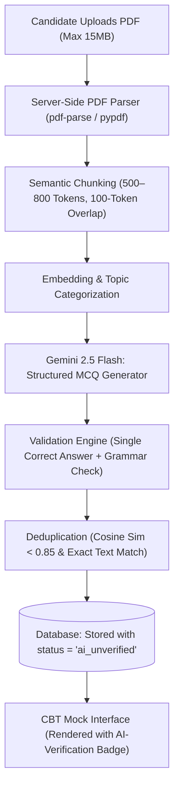

# ExamSathi (परीक्षा साथी) — AI PDF-to-MCQ Pipeline & Quality Assurance

**Document Version:** 1.0.0  
**Target Model:** Google Gemini 2.5 Flash (for extraction/generation) & Gemini 2.5 Pro (for validation)  
**Security & Privacy:** DPDP Act 2023 Compliant / Zero Data Leakage / Zero Training on User Notes

---

## 1. Pipeline Overview & Data Flow

The ExamSathi AI Engine transforms candidate notes or official PDF syllabi into high-yield, exam-aligned practice sets:



---

## 2. Six-Stage Quality & Safety Pipeline

### Stage 1: Private Parsing & Sanitization
1. **Private Storage:** Uploaded files are stored in a private Supabase bucket (`user-documents/<user_id>/<doc_id>.pdf`) accessible exclusively by the uploading user via RLS.
2. **Text Extraction:** In-memory extraction strips non-printable control characters, watermarks, and header/footer boilerplate.
3. **No Model Training:** All requests to Gemini API utilize explicit zero-retention parameters, ensuring user data is never used to train or tune foundation models.

### Stage 2: Topic Analysis & Chunking
- Documents are split into semantic chunks (500–800 words) using heading-aware boundaries (`H1`, `H2`, bulleted lists).
- Chunks identify key entities: Historical Dates, Constitutional Articles, Scientific Laws, Mathematical Theorems, Pedagogical Stages.

### Stage 3: Structured Generation Prompt
Generates questions matching the exact pattern of state competitive exams (e.g., Master Cadre, PSSSB Clerk, REET):

```json
{
  "systemInstruction": "You are a senior exam paper setter for Indian state competitive exams (Punjab PSSSB, Master Cadre, REET). Given the study material chunk, generate high-yield, objective multiple-choice questions. Rules: 1) Exactly four mutually exclusive options. 2) Only one unambiguously correct answer. 3) Plausible distractors based on common student misconceptions. 4) No 'None of the above' or 'All of the above' unless strictly relevant. 5) Provide comprehensive explanations detailing why the correct option is right and why each distractor is wrong.",
  "responseSchema": {
    "type": "array",
    "items": {
      "type": "object",
      "properties": {
        "stem": {
          "type": "object",
          "properties": { "hi": { "type": "string" }, "pa": { "type": "string" }, "en": { "type": "string" } },
          "required": ["hi", "en"]
        },
        "options": {
          "type": "object",
          "properties": {
            "A": { "type": "object", "properties": { "hi": { "type": "string" }, "pa": { "type": "string" }, "en": { "type": "string" } } },
            "B": { "type": "object", "properties": { "hi": { "type": "string" }, "pa": { "type": "string" }, "en": { "type": "string" } } },
            "C": { "type": "object", "properties": { "hi": { "type": "string" }, "pa": { "type": "string" }, "en": { "type": "string" } } },
            "D": { "type": "object", "properties": { "hi": { "type": "string" }, "pa": { "type": "string" }, "en": { "type": "string" } } }
          },
          "required": ["A", "B", "C", "D"]
        },
        "correct": { "type": "string", "enum": ["A", "B", "C", "D"] },
        "explanation": {
          "type": "object",
          "properties": { "hi": { "type": "string" }, "pa": { "type": "string" }, "en": { "type": "string" } }
        },
        "difficulty": { "type": "string", "enum": ["easy", "medium", "hard"] },
        "subtopic": { "type": "string" }
      },
      "required": ["stem", "options", "correct", "explanation", "difficulty"]
    }
  }
}
```

### Stage 4: Automated Verification & Sanity Gates
Before storing any generated question:
1. **Single Correct Option Verification:** A secondary lightweight prompt verifies that exactly one option is logically and factually true. If ambiguous, the question is discarded.
2. **Distractor Quality Gate:** Ensures distractors are not substrings or duplicates of the correct answer.
3. **Language Consistency:** Verifies that Hindi and Punjabi translations maintain educational accuracy (e.g., proper Gurmukhi technical vocabulary).

### Stage 5: Deduplication (Exact & Semantic)
1. **Exact Deduplication:** SHA-256 fingerprinting on normalized stem text (`trim()`, `lowercase()`, stripping punctuation).
2. **Semantic Deduplication:** For existing database items, cosine similarity is computed against text embeddings. Items with similarity > 0.88 to an existing question in the same topic are discarded.

### Stage 6: Provenance & User Tagging
- All AI-generated items are flagged with `status = 'ai_unverified'`.
- The CBT interface displays:
  > ⚠️ **AI-Generated Drill:** Synthesized from your uploaded notes. Reviewed by AI verification gates; pending human educator sign-off.
- Performance in AI drills produces diagnostic analytics: naming specific weak sub-topics (e.g., *"Weakness detected in Article 21A & RTE Act 2009 provisions"*).

---

## 3. Cost Controls, Rate Limits & Caching Strategy

| Parameter | Specification | Enforcement Mechanism |
| :--- | :--- | :--- |
| **User Daily Quota** | 5 PDF conversions per user / day (Free tier) | PostgreSQL Token Bucket / Redis |
| **Max Document Size** | 15 MB / Maximum 50 Pages | Client & Server File Size Validator |
| **Semantic Response Cache** | 30-Day TTL for identical document hashes | `ai_generation_cache` table |
| **Cost Safeguard Cap** | $0.05 max per user per day | Hard circuit breaker on edge gateway |
