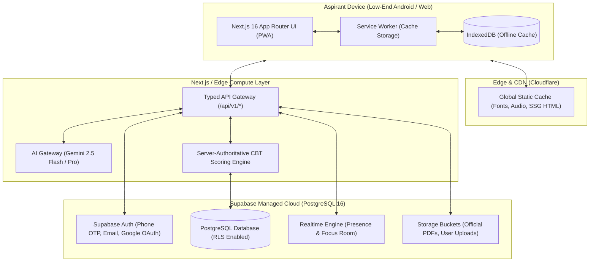

# ExamSathi (परीक्षा साथी) — Target System Architecture

**Document Version:** 1.0.0  
**Status:** Approved Architectural Blueprint  
**Target Platform:** Mobile-First Indic PWA (Android / Web)  
**Target Latency:** < 1.5s First Contentful Paint on 3G (low-end Android devices)

---

## 1. Architectural Vision & Design Principles

ExamSathi is architected to provide free, high-fidelity competitive examination preparation for millions of Indian aspirants across state and central recruitment boards (Punjab, Rajasthan, Haryana, Delhi, and Central). The platform must meet five non-negotiable architectural criteria:

1. **Low-End Mobile & Weak Network Resilience:** Sub-150KB initial JS payload, instant local caching via Service Workers & IndexedDB, offline lesson reading and offline mock attempt logging with background synchronization.
2. **True Trilingual Parity (Hindi, Punjabi Gurmukhi, English):** Key-based i18n, localized URLs, dynamic typography with optimized web-font subsets (Noto Sans Gurmukhi and Devanagari), and bidirectional phonetic input compatibility.
3. **Data-Driven Scalability (Zero-Code Exam Additions):** Adding any state (e.g., Haryana, Himachal, Delhi) or exam (e.g., Delhi Police, HTET, UGC NET) requires only a data migration or CMS entry—zero UI code modifications.
4. **Server-Authoritative Security:** Answers and rationales are withheld until submission; CBT scoring, percentiles, negative marking, and user ranks are computed strictly server-side.
5. **Secure Server-Side AI Gateway:** All AI operations (PDF-to-MCQ parsing, automated explanation generation, adaptive weak-topic drills) pass through an edge-based gateway enforcing rate limits, semantic caching, schema validation, and cost caps.

---

## 2. Technology Stack Selection & Trade-Off Analysis

### 2.1 Backend Decision: Supabase (PostgreSQL) vs. Firebase

| Evaluation Criteria | Firebase (Firestore + Auth) | Supabase (PostgreSQL + Auth + RLS) | Architectural Decision |
| :--- | :--- | :--- | :--- |
| **Data Model & Relationships** | NoSQL Document Store. Complex parent-child syllabus hierarchies require denormalization or costly multi-query joins. | Relational PostgreSQL. Hierarchical recursive CTE queries (`WITH RECURSIVE`) for syllabus trees (Subject → Unit → Topic → Subtopic). | **Supabase Winner:** Deep academic syllabus models are inherently relational. |
| **Row Level Security (RLS)** | Firestore Security Rules (proprietary syntax, difficult to unit test in CI). | PostgreSQL Row Level Security (ANSI SQL, testable via `pgTAP`, native role management). | **Supabase Winner:** Standardized, battle-tested DB security. |
| **Server-Authoritative Scoring** | Cloud Functions with Firestore triggers (cold start latency 1.5s–3s). | Supabase Edge Functions (Deno runtime, < 50ms cold starts globally). | **Supabase Winner:** Essential for low-latency CBT test submissions. |
| **Full-Text & Multilingual Search** | Requires external Algolia/Typesense integration ($$$). | Native PostgreSQL Full-Text Search with `pg_trgm` and Indic stemmers. | **Supabase Winner:** Zero extra cost, high-speed Hindi/Punjabi/English search. |
| **Cost & Data Portability** | Proprietary lock-in; document read spikes on large mock attempt cohorts can cause unexpected bills. | Open-source PostgreSQL; can run on self-hosted VPS, Docker, or managed cloud with predictable pricing. | **Supabase Winner:** Matches our commitment to free educational access. |

**Verdict:** **Supabase (PostgreSQL 16+)** is selected as the primary backend and database engine.

---

### 2.2 Frontend Stack & Hosting

- **Framework:** Next.js 16 (App Router) + React 19 + TypeScript.
- **Styling:** Tailwind CSS v4 (minimal CSS bundle, zero-runtime overhead).
- **Client State:** Zustand v5 (lightweight, < 3KB bundle impact) paired with `@tanstack/react-query` for server state caching.
- **PWA / Offline Engine:** `serwist` / native Service Worker + IndexedDB (`idb-keyval`) for offline test caching.
- **Hosting & Edge Delivery:** Cloudflare Pages / Vercel with Cloudflare CDN caching Indic font subsets and static lesson assets.

---

## 3. High-Level Architecture Diagram



---

## 4. Folder Structure

```
examsathi/
├── docs/                             # Engineering, architecture, and content documentation
│   ├── AUDIT.md                      # Phase 0 verification & 16-bug register
│   ├── ARCHITECTURE.md               # This document
│   ├── DATA_MODEL.md                 # ERD, SQL DDL migrations, RLS policies
│   ├── API.md                        # REST / RPC API specifications
│   ├── AI_PIPELINE.md                # PDF-to-MCQ pipeline & cost management
│   ├── ROADMAP.md                    # Multi-milestone delivery timeline
│   ├── SECURITY.md                   # OWASP compliance, CSP, and threat model
│   ├── TESTING.md                    # Unit, integration, and Playwright E2E strategy
│   ├── CONTENT_GUIDE.md              # Official syllabus verification guidelines
│   └── ADSENSE_CHECKLIST.md          # Monetization readiness & DPDP compliance
├── supabase/
│   ├── migrations/                   # Sequential SQL migrations (001_initial_schema.sql...)
│   ├── seed.sql                      # Production seed for states, exams, and verified questions
│   └── functions/                    # Supabase Edge Functions
│       ├── submit-cbt-attempt/       # Authoritative score, rank, and analytics calculator
│       └── ai-pdf-to-mcq/            # Private PDF parsing, chunking, and question generation
├── src/
│   ├── app/                          # Next.js App Router
│   │   ├── (auth)/                   # Real Supabase Auth flows (login, register, forgot-password)
│   │   ├── (dashboard)/              # Authenticated student portal
│   │   │   ├── dashboard/            # Dynamic progress KPIs & weak-topic alerts
│   │   │   ├── exams/                # Pure data-driven exam catalog
│   │   │   ├── study/                # Multilingual syllabus tree & reader
│   │   │   ├── mock-test/            # CBT simulator with section timers & autosave
│   │   │   ├── library/              # Virtual library with real presence & wellness coach
│   │   │   ├── typing-practice/      # Official Raavi Inscript benchmark test
│   │   │   ├── roadmap/              # Dynamic adaptive 60-day study tracker
│   │   │   ├── daily-gk/             # "Today in History" & daily current affairs
│   │   │   └── admin/                # Role-gated CMS (admin, editor, reviewer)
│   │   ├── api/                      # Next.js Edge Route Handlers
│   │   │   ├── v1/exams/
│   │   │   ├── v1/mock/
│   │   │   └── v1/ai/
│   │   ├── layout.tsx                # WCAG AA compliant root layout
│   │   └── page.tsx                  # Public landing page with localized metadata
│   ├── components/                   # Modular React components
│   │   ├── cbt/                      # Question palette, timer, review flags
│   │   ├── flashcard/                # FSRS spaced repetition flip component
│   │   ├── indic-keyboard/           # On-screen visual Gurmukhi Inscript helper
│   │   └── wellness/                 # Hydration & 20-20-20 eye rest modal
│   └── lib/
│       ├── ai/                       # Semantic deduplication, prompt templates, schemas
│       ├── fsrs/                     # Free Spaced Repetition Scheduling algorithm
│       ├── supabase/                 # Typed Supabase client (client & server)
│       └── i18n/                     # Gurmukhi, Devanagari, English dictionaries
└── public/
    ├── fonts/                        # Subdivided WOFF2 Indic fonts (< 50KB each)
    ├── sw.js                         # Offline Service Worker
    └── manifest.json                 # PWA install manifest
```

---

## 5. Server-Side AI Gateway Specification

All interactions with LLMs (Google Gemini 2.5 Flash / Pro) are encapsulated inside `src/lib/ai/` and executed exclusively on the server side:

1. **Client Isolation:** The frontend never receives AI API keys or direct endpoints. All requests pass through `/api/v1/ai/generate-mcq` or Supabase Edge Functions.
2. **Deterministic Output:** Structured JSON extraction is enforced using Gemini Structured Outputs with strict JSON Schema definitions.
3. **Semantic Caching:** Hashes of source paragraphs/chunks are checked against an Indexed cache table (`ai_generation_cache`) to prevent redundant API token costs.
4. **Per-User Quotas:** Strict rate limits (e.g., maximum 5 PDF generation requests per user per day for free tier) managed via PostgreSQL token buckets.
5. **Privacy Assurance:** Candidate uploaded notes and PDFs are parsed in temporary worker memory, tagged with `is_private = true`, and strictly excluded from public indexes and model training.
6. **Provenance & Verification Flagging:** Any question created via AI is stored with `status = 'ai_unverified'`. The UI renders a distinct *"AI-Generated (Review in Progress)"* badge until an educator validates it.

---

## 6. Offline PWA & Low-End Device Optimization Strategy

1. **Indic Font Subsetting:**
   - Standard Google Fonts for Gurmukhi and Devanagari exceed 800KB.
   - We subset `NotoSansGurmukhi` and `NotoSansDevanagari` to only Punjabi Unicode block (`U+0A00–U+0A7F`), Devanagari block (`U+0900–U+097F`), and Latin (`U+0000–U+00FF`), compressing each font to under 38KB in WOFF2 format.
2. **Offline CBT Simulation:**
   - When a student begins a mock test, the full question text and options (without answers) are cached in `IndexedDB`.
   - If the student loses mobile connectivity mid-test, the countdown timer and question palette continue running seamlessly.
   - Answers are autosaved to `IndexedDB` on every option click. Upon reconnection, an asynchronous Service Worker sync worker submits the attempt to `/api/v1/mock/submit`.

---

## 7. Zero-Loss Migration Strategy

To transition from the current static export to the full target architecture without user disruption:
1. **Milestone 1 & 2:** Harden the existing client code, eliminating all 16 Phase 0 bugs (stuck spinners, link mismatches, fake library presence, and typos) on the existing static build.
2. **Milestone 3:** Deploy database migrations to Supabase and seed all existing static data (`exams.ts`, `lessons.ts`, `questions.ts`, `pyqs.ts`) into Postgres tables with 100% data fidelity.
3. **Milestone 4:** Connect Next.js data fetching to Supabase with progressive enhancement (falls back to local static JSON if the network is completely down).
