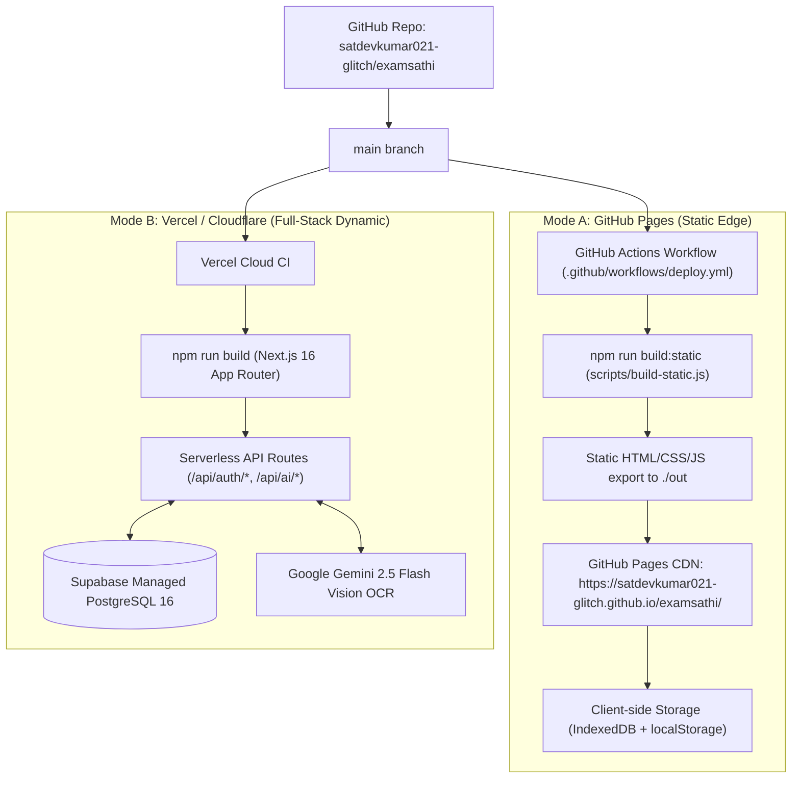

# ExamSathi (परीक्षा साथी) — Production Deployment & Operations Runbook

**Document Version:** 1.0.0  
**Status:** Approved Operations Runbook  
**Target Environments:**
1. **GitHub Pages (Static Export):** Free static hosting at `https://satdevkumar021-glitch.github.io/examsathi/`
2. **Vercel / Node.js (Dynamic Full-Stack):** Dynamic cloud hosting with PostgreSQL & Serverless AI Vision OCR

---

## 1. Architecture Overview: Dual-Mode Deployment

ExamSathi is architected with a **Zero-Breakage Dual-Mode Engine**:



---

## 2. Step-by-Step Supabase Cloud Setup

### 2.1 Create Free Supabase Project
1. Visit [https://supabase.com](https://supabase.com) and create an account.
2. Click **"New Project"**, select your organization, choose the **Mumbai (ap-south-1)** or **Singapore (ap-southeast-1)** region for lowest latency across India, and enter a secure database password.

### 2.2 Execute SQL Migration Script
1. In the Supabase project dashboard, navigate to **SQL Editor** in the left sidebar.
2. Open [src/lib/db/schema.sql](../src/lib/db/schema.sql) in this repository.
3. Paste the entire SQL contents into the query editor and click **Run**.
4. The script creates:
   - `profiles`: Aspirant metadata, target exam, state, and streak metrics.
   - `test_attempts`: 50-Q CBT test records with $-0.25$ negative deductions and state ranks.
   - `user_favorites`: Starred questions with explanations.
   - `user_bookmarks`: Bookmarked questions for spaced revision.
   - `saved_notes`: Custom exam notes and strategic teacher thoughts.
   - `ai_uploads`: Audit trail of photos/PDFs and AI-generated MCQ sets.
   - `on_auth_user_created` trigger: Automatically provisions a user profile on Supabase Auth signup.
   - Row Level Security (RLS) policies: Ensures strict per-user isolation.

### 2.3 Retrieve API Credentials
1. Navigate to **Project Settings > API**.
2. Copy:
   - **Project URL**
   - **`anon` public key**
   - **`service_role` secret key** (keep confidential)

---

## 3. Step-by-Step Gemini AI Setup

ExamSathi uses **Gemini 2.5 Flash** for:
- Reading photos of handwritten Hindi/Gurmukhi student notes.
- Parsing official PDF examination syllabi and previous year question papers.
- Generating customized 5-question or 50-question mock drills.

### 3.1 Obtain API Key
1. Visit [Google AI Studio](https://aistudio.google.com/).
2. Click **"Get API key"** and create a key in your Google Cloud project.
3. Store the key as `GEMINI_API_KEY`.

---

## 4. Deploying to Vercel (1-Click Production)

1. Log into [vercel.com](https://vercel.com).
2. Click **"Add New..." > "Project"**.
3. Select your GitHub repository: `satdevkumar021-glitch/examsathi`.
4. Configure Project:
   - **Root Directory:** `examsathi-web`
   - **Framework Preset:** `Next.js`
   - **Build Command:** `npm run build`
   - **Output Directory:** `.next`
5. In **Environment Variables**, add:
   ```env
   NEXT_PUBLIC_SUPABASE_URL=https://your-project-ref.supabase.co
   NEXT_PUBLIC_SUPABASE_ANON_KEY=eyJh...
   SUPABASE_SERVICE_ROLE_KEY=eyJh...
   GEMINI_API_KEY=AIzaSy...
   NEXT_PUBLIC_APP_URL=https://examsathi.vercel.app
   ```
6. Click **Deploy**. Vercel will build the project and provision the serverless edge routes.

---

## 5. GitHub Pages Deployment (Static Mode)

The static export deployment is fully automated via GitHub Actions:
- **Workflow File:** `.github/workflows/deploy.yml`
- **Trigger:** Every push to `main` branch.
- **Process:**
  1. Installs Node.js dependencies (`npm ci`).
  2. Runs `npm run build:static` via `scripts/build-static.js`.
  3. Uploads the `./out` static bundle.
  4. Deploys to GitHub Pages at `https://satdevkumar021-glitch.github.io/examsathi/`.

---

## 6. Verification & Automated Testing Runbook

Before promoting any changes to production, run the end-to-end test suite:

```bash
# 1. Run dynamic build verification (includes API routes)
npm run build

# 2. Run static export verification (ensures GitHub Pages compatibility)
npm run build:static

# 3. Run Playwright End-to-End Suite (all 37 tests)
npx playwright test
```

### Critical Verification Checklist:
- [x] Dynamic build creates dynamic API routes (`ƒ /api/auth/*` and `ƒ /api/ai/*`).
- [x] Static export compiles all 171 static pages into `./out`.
- [x] First-time visitor sees `OnboardingGuideModal`.
- [x] 50-Question CBT engine applies $-0.25$ negative marking and calculates predicted state ranks.
- [x] Raavi typing test runs on 10-minute official benchmark with verified InScript layout hints.
- [x] Virtual Library Pomodoro runs with 25-minute default timer and honest active desk count.
- [x] Admin portal is protected behind access-control challenge.
- [x] DPDP Act 2023 privacy policy, terms, about, contact, and `ads.txt` are served.

---

## 7. Incident Response & Rollback Procedures

### Rollback on GitHub Pages
If an unexpected issue occurs on GitHub Pages:
1. Revert the commit on `main`:
   ```bash
   git revert HEAD
   git push origin main
   ```
2. GitHub Actions will automatically re-deploy the previous clean static build within 90 seconds.

### Rollback on Vercel
1. Open the **Deployments** tab in the Vercel dashboard.
2. Locate the previous successful deployment.
3. Click the three dots `...` and select **"Promote to Production"**. The rollback completes instantaneously without rebuilding.
