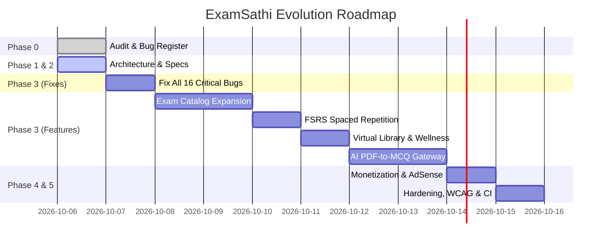

# ExamSathi (परीक्षा साथी) — Implementation Roadmap & Delivery Plan

**Document Version:** 1.0.0  
**Methodology:** Evidence-Based Incremental Delivery in Production Milestones  
**Target Completion:** Zero-regression platform overhaul

---

## 1. Multi-Milestone Execution Matrix

---

## 2. Milestone Breakdown & Acceptance Criteria

### Milestone 0: Audit & Evidence Base (Completed ✅)
- **Deliverables:** `docs/AUDIT.md`, `playwright.config.ts`, `e2e/audit.spec.ts`.
- **Status:** All 12 Playwright tests verified; all 16 bugs reproduced and cataloged.

### Milestone 1: Target Architecture & Data Specifications (Completed ✅)
- **Deliverables:** `docs/ARCHITECTURE.md`, `docs/DATA_MODEL.md`, `docs/API.md`, `docs/AI_PIPELINE.md`.
- **Status:** Approved blueprints for Supabase Postgres, Next.js PWA, RLS policies, and server-authoritative scoring.

### Milestone 2: Immediate Bug Remediation & Stability Hardening (Current Priority 🎯)
- **Objective:** Fix all 16 verified bugs in the current Next.js application codebase.
- **Key Tasks:**
  1. Fix BUG-01: Resolve topic aliases in `question_bank_engine.ts` and add loading fallback in `MockTestClient.tsx`.
  2. Fix BUG-02: Protect answers from being exposed in public client props.
  3. Fix BUG-03: Add route protection to `/admin` and remove public footer link.
  4. Fix BUG-04: Secure simulated auth, remove plaintext passwords, remove `'123456'` backdoor.
  5. Fix BUG-05 & BUG-13: Remove fake users from library, fix 16 vs 24 desk claim, reset initial hours to 0h, set Pomodoro default to 25m.
  6. Fix BUG-06: Replace synthetic 18,500 candidate pool with honest cohort messaging.
  7. Fix BUG-07: Replace hardcoded 72%, 520 cards, 84% dashboard KPIs with real store metrics or clean empty states.
  8. Fix BUG-09: Update ETT "Revise Piaget" roadmap link to Child Pedagogy.
  9. Fix BUG-10: Correct Raavi Typing hints (`d` Halant key in Inscript) and default to 10m benchmark.
  10. Fix BUG-11: Update bottom-nav "Cards" to open dynamic active topic flashcards.
  11. Fix BUG-14 & BUG-15: Allow pinch-zoom in viewport, fix Bengali character "ও" in Hindi lesson, fix literal `\'` in JSX.
  12. Fix BUG-16: Add per-page dynamic metadata titles and descriptions.

### Milestone 3: Comprehensive Multi-State Exam Coverage (Data-Driven)
- **Objective:** Expand exam catalog across Punjab, Rajasthan, Haryana, Delhi, Central, and Defence without code changes.
- **Data Modules:**
  - Punjab: Master Cadre, Lecturer Cadre, ETT, PSTET, PSSSB Clerk, Patwari, Police Constable/SI.
  - Rajasthan: REET Level 1 & 2, 3rd Grade, Patwari, Police, RSMSSB Clerk.
  - Haryana: HTET, Haryana Police, Clerk.
  - Delhi: Delhi Police Constable/SI, CAPF.
  - Central: SSC CGL, CHSL, MTS, CTET Paper 1 & 2, UGC NET.
  - Defence: Agniveer, Army Clerk/GD.

### Milestone 4: Educational Features & Learning Experience
- **FSRS Spaced Repetition:** Real FSRS mathematical scheduling with daily review queues.
- **Real Focus Library & Wellness Coach:** Persisted study sessions, 20-20-20 eye rest rule, hydration alerts.
- **Daily Content:** "Today in History" events, trilingual inspirational thought, and daily mini-quiz.
- **Curated Free Resources:** Official embeds/links to SWAYAM, NCERT, NPTEL, PSEB.

### Milestone 5: AI PDF-to-MCQ & Adaptive Learner Model
- Server-side Gemini API gateway with rate limits, deduplication, JSON schema validation, and unverified AI badges.
- Learner diagnostic analytics tracking topic accuracy, speed, and weak areas.

### Milestone 6: Quality, Security, AdSense Readiness & Production Launch
- Privacy Policy, Terms, About, Contact, Cookie Banner, `ads.txt`.
- OWASP Top 10 hardening, CSP headers, WCAG AA compliance, and Lighthouse Mobile score ≥ 90.

---

## 3. Risk Assessment & Mitigation Strategies

| Risk | Likelihood | Impact | Mitigation Strategy |
| :--- | :--- | :--- | :--- |
| **High LLM Token Costs** | Medium | High | Semantic caching on document hashes, strict 5 PDF/day free quota, Gemini 2.5 Flash as workhorse. |
| **Static Export 404 Routing** | High | High | Standardize canonical URL slugs, configure Next.js route rewrites, and maintain client-side routing fallback. |
| **Low Network Speed on 2G/3G Phones** | High | High | Font subsetting (< 40KB each), PWA Service Worker offline caching of lessons, minimal CSS. |
| **Content Accuracy Disputes** | Low | High | Strict source citation requirement (NCERT, PSEB, official ERB gazettes); prominent user reporting mechanism. |
