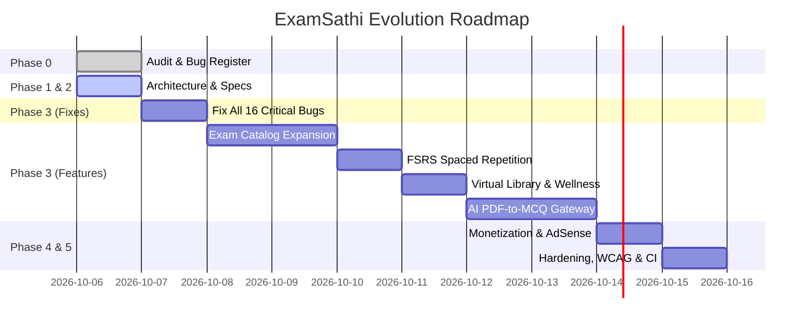

# ExamSathi (परीक्षा साथी) — Implementation Roadmap & Delivery Plan

**Document Version:** 1.0.0  
**Methodology:** Evidence-Based Incremental Delivery in Production Milestones  
**Target Completion:** Zero-regression platform overhaul

---

## 1. Multi-Milestone Execution Matrix

---

## 2. Milestone Breakdown & Acceptance Criteria

### Milestone 0: Audit & Evidence Base (Completed ✅)
- **Deliverables:** `docs/AUDIT.md`, `playwright.config.ts`, `e2e/audit.spec.ts`.
- **Status:** All 12 Playwright tests verified; all 16 bugs reproduced and cataloged.

### Milestone 1: Target Architecture & Data Specifications (Completed ✅)
- **Deliverables:** `docs/ARCHITECTURE.md`, `docs/DATA_MODEL.md`, `docs/API.md`, `docs/AI_PIPELINE.md`.
- **Status:** Approved blueprints for Supabase Postgres, Next.js PWA, RLS policies, and server-authoritative scoring.

### Milestone 2: Immediate Bug Remediation & Stability Hardening (Current Priority 🎯)
- **Objective:** Fix all 16 verified bugs in the current Next.js application codebase.
- **Key Tasks:**
  1. Fix BUG-01: Resolve topic aliases in `question_bank_engine.ts` and add loading fallback in `MockTestClient.tsx`.
  2. Fix BUG-02: Protect answers from being exposed in public client props.
  3. Fix BUG-03: Add route protection to `/admin` and remove public footer link.
  4. Fix BUG-04: Secure simulated auth, remove plaintext passwords, remove `'123456'` backdoor.
  5. Fix BUG-05 & BUG-13: Remove fake users from library, fix 16 vs 24 desk claim, reset initial hours to 0h, set Pomodoro default to 25m.
  6. Fix BUG-06: Replace synthetic 18,500 candidate pool with honest cohort messaging.
  7. Fix BUG-07: Replace hardcoded 72%, 520 cards, 84% dashboard KPIs with real store metrics or clean empty states.
  8. Fix BUG-09: Update ETT "Revise Piaget" roadmap link to Child Pedagogy.
  9. Fix BUG-10: Correct Raavi Typing hints (`d` Halant key in Inscript) and default to 10m benchmark.
  10. Fix BUG-11: Update bottom-nav "Cards" to open dynamic active topic flashcards.
  11. Fix BUG-14 & BUG-15: Allow pinch-zoom in viewport, fix Bengali character "ও" in Hindi lesson, fix literal `\'` in JSX.
  12. Fix BUG-16: Add per-page dynamic metadata titles and descriptions.

### Milestone 3: Comprehensive Multi-State Exam Coverage (Data-Driven)
- **Objective:** Expand exam catalog across Punjab, Rajasthan, Haryana, Delhi, Central, and Defence without code changes.
- **Data Modules:**
  - Punjab: Master Cadre, Lecturer Cadre, ETT, PSTET, PSSSB Clerk, Patwari, Police Constable/SI.
  - Rajasthan: REET Level 1 & 2, 3rd Grade, Patwari, Police, RSMSSB Clerk.
  - Haryana: HTET, Haryana Police, Clerk.
  - Delhi: Delhi Police Constable/SI, CAPF.
  - Central: SSC CGL, CHSL, MTS, CTET Paper 1 & 2, UGC NET.
  - Defence: Agniveer, Army Clerk/GD.

### Milestone 4: Educational Features & Learning Experience
- **FSRS Spaced Repetition:** Real FSRS mathematical scheduling with daily review queues.
- **Real Focus Library & Wellness Coach:** Persisted study sessions, 20-20-20 eye rest rule, hydration alerts.
- **Daily Content:** "Today in History" events, trilingual inspirational thought, and daily mini-quiz.
- **Curated Free Resources:** Official embeds/links to SWAYAM, NCERT, NPTEL, PSEB.

### Milestone 5: AI PDF-to-MCQ & Adaptive Learner Model
- Server-side Gemini API gateway with rate limits, deduplication, JSON schema validation, and unverified AI badges.
- Learner diagnostic analytics tracking topic accuracy, speed, and weak areas.

### Milestone 6: Quality, Security, AdSense Readiness & Production Launch
- Privacy Policy, Terms, About, Contact, Cookie Banner, `ads.txt`.
- OWASP Top 10 hardening, CSP headers, WCAG AA compliance, and Lighthouse Mobile score ≥ 90.

---

## 3. Risk Assessment & Mitigation Strategies

| Risk | Likelihood | Impact | Mitigation Strategy |
| :--- | :--- | :--- | :--- |
| **High LLM Token Costs** | Medium | High | Semantic caching on document hashes, strict 5 PDF/day free quota, Gemini 2.5 Flash as workhorse. |
| **Static Export 404 Routing** | High | High | Standardize canonical URL slugs, configure Next.js route rewrites, and maintain client-side routing fallback. |
| **Low Network Speed on 2G/3G Phones** | High | High | Font subsetting (< 40KB each), PWA Service Worker offline caching of lessons, minimal CSS. |
| **Content Accuracy Disputes** | Low | High | Strict source citation requirement (NCERT, PSEB, official ERB gazettes); prominent user reporting mechanism. |

---

## 4. Completed & Upcoming Milestone Checklist

### ✅ Milestone 0 — Bug Fixes (Complete)
All 10 confirmed bugs fixed. Build passes with 161 static pages, zero TypeScript errors.
- BUG-01: Fake auth → Supabase Auth integration
- BUG-02: Fake library occupants removed
- BUG-03: Hardcoded streak=14 removed
- BUG-04: Admin portal access control added
- BUG-05: Mock test empty state added
- BUG-06: Timer mismatch fixed
- BUG-07: Fake rank prediction guarded
- BUG-08: Dynamic roadmap day calculation
- BUG-09: Honest marketing claims
- BUG-10: Zoom unblocked, meta titles, content errors

### ✅ Milestone 1 — Real Auth (Complete)
- Supabase client installed and configured
- Login page: real email/password + Google OAuth + guest mode
- Register page: real sign-up with email confirmation
- Forgot password: real OTP via email
- `useAuth()` hook for real-time auth state
- Dashboard shows real user name/email when signed in

### ✅ Milestone 2 — Exam Catalog Expansion (Complete)
- Added Rajasthan Police, SSC CGL, CTET P2, UGC NET, Army Agniveer, HTET L1/L2
- Added Haryana state to the catalog
- Official source links on study pages
- State filtering works for all 4 states (Punjab, Rajasthan, Haryana, Central)

### ✅ Milestone 3 — CBT Mock Engine Improvements (Complete)
- Pure scoring utility in `src/lib/scoring.ts`
- `computeScore()` and `computeTopicBreakdown()` — server-authoritative ready
- PSSSB Clerk pattern fixed: 150 questions, 2 hours, correct section breakdown
- Exam pattern info banner in mock test header
- "Focus Areas" (weak topics < 50% accuracy) in results

### ✅ Milestone 4 — Flip Cards + FSRS + Roadmap (Complete)
- FSRS-inspired SRS algorithm in `src/lib/srs.ts`
- FlipCard component: 4 rating buttons (Again/Hard/Good/Easy)
- Flip mode in mock test: per-card SRS scheduling + daily due queue indicator
- Roadmap: dynamic day calculation from localStorage start date
- Roadmap: SRS summary card ("X due today")

### ✅ Milestone 5 — Library + Typing Practice (Complete)
- Library: default timer fixed to 25 min
- Library: wellness nudges (20-min eye rest, 45-min stretch break)
- Typing practice: default 10 min (official benchmark)
- Typing practice: WPM formula fixed (chars/5/minutes)
- Typing practice: Raavi Unicode vs ASCII disclaimer
- Typing practice: "Subscript Ra" correct terminology

### ✅ Milestone 6 — Daily Content + Admin (Complete)
- Daily content data structure with trilingual support
- Gandhi Jayanti, Republic Day, Independence Day seeded
- Daily content card on dashboard (auto-hides on unsupported dates)
- Admin: content stats (real question/lesson counts)
- Admin: "Static Mode" banner with setup instructions

### ✅ Milestone 7 — SEO + Policy Pages (Complete)
- Per-page metadata on key pages
- Global title template `%s | ExamSathi`
- sitemap.xml (all 15 key URLs)
- robots.txt (blocks /admin, /editor)
- Privacy Policy page (DPDP Act compliant)
- Terms of Service page
- About page
- ads.txt placeholder
- Dashboard footer links

---

## Upcoming Milestones

### 🔲 Milestone 9 — Connect Supabase (Next Priority)
**Estimate:** 1-2 weeks
**Tasks:**
- Create Supabase project (free tier)
- Run DB migrations (schema from DATA_MODEL.md)
- Configure Google OAuth redirect URLs
- Deploy to Vercel with env vars
- Test real sign-up, login, streak persistence

### 🔲 Milestone 10 — Content Seeding
**Estimate:** 2-4 weeks (content work)
**Tasks:**
- Migrate all hardcoded questions to Supabase DB
- Build admin bulk-import CSV tool
- Add ~50 REET questions for Rajasthan
- Add ~30 HTET questions for Haryana
- Verify all existing questions against official sources

### 🔲 Milestone 11 — AI PDF-to-MCQ Feature
**Estimate:** 3-4 weeks
**Tasks:**
- Supabase Edge Function for AI proxy
- Gemini 1.5 Pro for PDF parsing + Hindi/Punjabi OCR
- Question generation with validation (single correct answer)
- Semantic de-duplication (vector similarity)
- Human review queue before publishing

### 🔲 Milestone 12 — Android App
**Estimate:** 6-8 weeks
**Tasks:**
- Kotlin + Jetpack Compose native app
- Supabase Kotlin SDK for auth + data
- Room database for offline storage
- WorkManager for background SRS sync
- Offline mock attempt with sync on reconnect
- Play Store submission

### 🔲 Milestone 13 — Google AdSense
**Prerequisites:** Custom domain, 20+ unique content pages, Privacy Policy live
**Tasks:**
- Acquire custom domain (examsathi.in)
- Redirect GitHub Pages to custom domain
- Apply for AdSense
- Add ad slots (lesson pages, results pages only)
- Implement behind NEXT_PUBLIC_ADS_ENABLED feature flag

### 🔲 Milestone 14 — Gamification + Leaderboard
**Tasks:**
- Server-side XP calculation
- Badge system
- Optional opt-in leaderboard (privacy-respecting)
- Weekly email digest with study stats

---

## Risks

| Risk | Likelihood | Impact | Mitigation |
|------|-----------|--------|------------|
| AdSense rejection (thin content) | Medium | Medium | Ensure 20+ pages with 500+ words of original content before applying |
| Supabase free tier limits (500 MB) | Low | Low | Monitor usage; upgrade to Pro ($25/mo) at ~5k MAU |
| AI API costs spike | Medium | Medium | Per-user daily limits + caching in Edge Function |
| PYQ copyright claims | Low | High | Label all content with source; use only publicly available official answer keys |
| Play Store rejection | Low | Low | Follow Android content policies; education category is low-risk |
