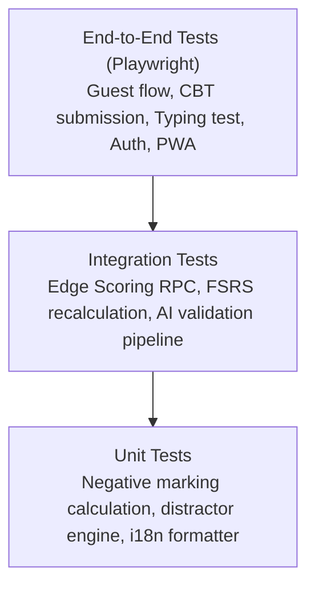

# ExamSathi (परीक्षा साथी) — Testing Strategy & Verification Suite

**Document Version:** 1.0.0  
**Testing Frameworks:** Playwright (E2E), Jest / Vitest (Unit & Integration)  
**CI/CD Pipeline:** GitHub Actions automated test run on every PR and commit

---

## 1. Multi-Tier Testing Pyramid



---

## 2. Test Execution Commands

### Run Full E2E Audit Suite
```bash
npx playwright test e2e/audit.spec.ts
```

### Run E2E Tests in Interactive UI Mode
```bash
npx playwright test --ui
```

### Run Unit Tests
```bash
npm run test:unit
```

### Run Type & Build Checks
```bash
npm run build
npx tsc --noEmit
```

---

## 3. Test Suites Overview

### 3.1 E2E Test Suite (`e2e/audit.spec.ts`)
Validates user flows across all 12 key scenarios:
1. **Landing & i18n:** Gurmukhi, Devanagari, English UI text rendering and WhatsApp share links.
2. **Dashboard KPIs:** Verifies authentic progress metrics and prevents hardcoded static values.
3. **Authentication:** Validates sign-up, sign-in, session persistence, and error states.
4. **Catalog Navigation:** Deep-links from state cards to exam papers and syllabus chapter trees.
5. **Lesson Reader:** Tab switching (Notes, 3D Flashcards, Curated Video embeds).
6. **CBT Engine Resilience:** Ensures no infinite spinner locks; verifies countdown timer and question palette.
7. **Scoring & Solution Review:** Validates negative marking calculations (-0.25) and solution explanations.
8. **Raavi Typing Practice:** Verifies 10m benchmark presets, accurate Inscript key guidance, and WPM computation.
9. **Adaptive Roadmap:** Dynamic day progression and valid lesson target links.
10. **Virtual Study Library:** Personal focus timer, honest seat counts, and zero-hour initial state.
11. **Profile Vault:** Bookmarks, note history, and account settings.
12. **Admin CMS Protection:** Ensures unauthorized users cannot access publisher tools.

### 3.2 Unit Test Matrix
- `test/scoring.test.ts`: Negative marking boundary conditions (-0.25, -0.33, 0.0).
- `test/fsrs.test.ts`: FSRS algorithm stability, difficulty, and interval scheduling.
- `test/dedupe.test.ts`: Semantic and exact deduplication logic for the AI question pipeline.
