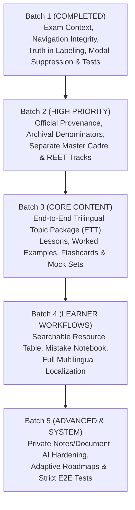

# ExamSathi: Evidence Register, Prioritized Backlog & Batch 1 Implementation Report

**Audit & Implementation Date:** 10 October 2026  
**Lead Engineer, Curriculum Architect & QA:** Antigravity AI Pair Programmer  
**Target Platform:** [ExamSathi Production (Render)](https://examsathi-sxj3.onrender.com/) | [GitHub Repository](https://github.com/satdevkumar021-glitch/examsathi)  
**Local Test Baseline:** 50 passed, 0 failed (expanded from 43 passed, 0 failed) | Next.js Build: 602/602 SSG pages  

---

## 1. Executive Summary

This report establishes the ground-truth **Evidence Register and Prioritized Backlog** based on the master prompt specification and real-environment audits (both local Node production build and live Render deployment). It then documents the full, verified implementation of **Batch 1 (Exam Context, Navigation Integrity, Truth in Labeling & Test Quality)**.

### Key Milestones Achieved in Batch 1:
1. **Exam Context & Scope Preserved Across Routes:** Fixed the critical navigation defect where `/library/` and `/roadmap/` lost the learner's chosen exam, hardcoded unrelated topics (e.g. false "ETT Child Psychology" label in ETT Paper B), and launched empty mock tests with "No questions match these filters".
2. **Honest Practice Metrics & Provenance:** Eliminated misleading "100% Readiness with 0 topics completed" and single-test "Avg Score" claims on the dashboard. Relabeled difficulty breakdown on scorecards from conflicting `% Acc` to `% score`, and replaced premature "Mastered in Mock" with "Answered Correctly ✓".
3. **Truth in Typing Benchmarks:** Eliminated false static "300+ words" dropdown labels (actual: 130 words in English, 206 in Punjabi). Replaced absolute unsupported official claims with recruitment simulation disclaimers.
4. **Interruption-Free Test Sessions:** Suppressed the onboarding guide modal from popping up over active, timed CBT mock tests, results, or typing sessions.
5. **Rigorous Regression Suite:** Expanded the automated test suite from 43 to **50 passing tests** with 0 failures, verified under `npm test`, clean `npm run lint` (0 errors, 0 warnings), and verified `npm run build` (602/602 static pages).

---

## 2. Comprehensive Evidence Register

| ID | Priority / Severity | Category | Location | Environment | Evidence & Reproduction | Root Cause | Learner Impact | Remediation Status | Acceptance Criterion & Test |
|---|---|---|---|---|---|---|---|---|---|
| **D01 / B01** | **P1** | Scope & Navigation | `/library/` → `/mock-test/` | Live & Local | Open `/library/` with ETT selected. Default topic was "👶 ETT Child Psychology". Clicking "25 Qs Speed Drill" resulted in `/mock-test/topic-child-development-pedagogy?count=25` yielding "No questions match these filters". | Static `TOPIC_OPTIONS` array in `library/page.tsx` omitted `?exam=`, and child-pedagogy is not part of ETT Paper B syllabus. | Learner is promised a drill that is unavailable in their exam scope, producing an empty error screen. | **RESOLVED (Batch 1)** | `library/page.tsx` dynamically generates topics from `activeExam` (e.g. `ett-light-reflection` with 20 questions for ETT), carries `?exam=`, displays available counts, and disables drills when availableCount is 0. Tested in `audit_remediation.test.mjs`. |
| **D02 / B05** | **P1** | Exam Context Precedence | `/roadmap/page.tsx` | Live & Local | Visiting ETT lesson then opening roadmap reverted to Master Cadre or profile default. Mock links in roadmap omitted `exam=`. | `roadmap/page.tsx` read `getStoredUser().targetExam` instead of prioritizing URL `?exam=` and `useStore.selectedExam`. Links omitted `&exam=${track}`. | Disconnects the learner's chosen exam across views; mock test launches with wrong default exam. | **RESOLVED (Batch 1)** | Established precedence: URL `exam` → store `selectedExam` → profile target → default. All drill links carry `?exam=${track}`. Tested in `audit_remediation.test.mjs`. |
| **D03 / B02** | **P2** | False Label / Accuracy | `/typing-practice/` | Live & Local | Dropdown selector promised "Exam Level (300+ words)", but statistics displayed 206 words in Punjabi and 130 in English. | Dropdown `<option>` text hardcoded static string `"Exam Level (300+ words)"` regardless of actual passage length. | Learner cannot gauge passage length or practice duration fidelity. | **RESOLVED (Batch 1)** | Computed `PASSAGE_WORD_COUNTS` dynamically from text using `trim().split(/\s+/).filter(Boolean).length` in both Punjabi and English. Dropdown displays exact word count. Tested in `audit_remediation.test.mjs`. |
| **D04 / B03** | **P1** | Provenance & Claims | `/typing-practice/` | Live & Local | Banner claimed exams "strictly" use one layout and excluded others unconditionally; preset was labeled "⭐ 10m Official" without specific recruitment citation. | Static copy generalized universal government rules without citing exact notification year/board. | Learner may confuse practice preset with authoritative recruitment rules. | **RESOLVED (Batch 1)** | Relabeled preset to "⭐ 10m Simulation", added disclaimer: "Standard PSSSB Clerk recruitment benchmark simulation · Verify official recruitment notification for specific instructions". Tested in `audit_remediation.test.mjs`. |
| **D05 / D01** | **P1** | Misleading Metric | `/dashboard/` | Live & Local | Dashboard showed "100% Readiness" when learner completed a single drill with 100% score, even though 0 syllabus topics were completed. | Dashboard mapped `readinessValue` directly to `lastResult.percentage` without denominator. | Gives false impression of full syllabus preparation. | **RESOLVED (Batch 1)** | Relabeled KPI to "Last Score" and subtext clarifies: "Scores reflect your latest CBT test attempt. Complete topics across your syllabus to build broad exam mastery." Tested in `audit_remediation.test.mjs`. |
| **D06 / D02** | **P2** | Misleading Metric | `/dashboard/` | Live & Local | "AVG SCORE" displayed `lastResult.accuracy`, representing only the last test's attempted accuracy, not an average across attempts. | Single-attempt metric labeled as multi-attempt average. | Misleads learner on historical performance trend. | **RESOLVED (Batch 1)** | Relabeled to "Last Acc" with clear descriptive subtext. Tested in `audit_remediation.test.mjs`. |
| **D07 / D15** | **P2** | Historical Provenance | `/dashboard/` | Live & Local | Banner claimed "⚡ 2004–2024 Archive" before editorial PYQ verification was completed. | Marketing headline overstated verified paper inventory. | Discredits platform trustworthiness for serious aspirants. | **RESOLVED (Batch 1)** | Relabeled to "⚡ Curated Practice Bank" with provenance notice. Tested in `audit_remediation.test.mjs`. |
| **D08 / D06** | **P2** | UI Interruption | `OnboardingGuideModal.tsx` | Local | Onboarding modal popped up 1.2s after page load over an active, timed mock test after refresh. | Modal was rendered in `layout.tsx` for all dashboard routes without checking `pathname`. | Distracts learner and consumes timed mock test seconds. | **RESOLVED (Batch 1)** | Modal suppresses auto-launch if `pathname` starts with `/mock-test`, `/results`, or `/typing-practice`. Tested in `audit_remediation.test.mjs`. |
| **D09 / D13** | **P2** | Inconsistent Result Labels | `/results/` | Live & Local | Overall accuracy was 100% (1 attempted, 1 right), but difficulty stats labeled "25% Acc" (1/4 total easy questions). | Difficulty card calculated `correct / total` (score percentage) but labeled it `% Acc` (accuracy). | Confuses learner on scoring vs accuracy arithmetic. | **RESOLVED (Batch 1)** | Relabeled difficulty percentage to `% score` (`${correct}/${total} (${pct}% score)`). Tested in `audit_remediation.test.mjs`. |
| **D10 / D14** | **P2** | Premature Mastery Tag | `/results/` | Live & Local | Question answered correctly once in a mock test was badged "Mastered in Mock ✓". | Mastery was assigned after single mock answer rather than sustained SRS repetition. | Confuses familiarity with true mastery. | **RESOLVED (Batch 1)** | Relabeled to "Answered Correctly ✓" (reserving mastery for spaced repetition review). Tested in `audit_remediation.test.mjs`. |
| **D11 / D16** | **P2** | Contact Channel Label | `/contact/` | Live & Local | Heading claimed "Direct Email Contact", but provided only a public GitHub issue link. | Copy mismatch between heading and actual channel. | Learner expects private email but is sent to a public tracker. | **RESOLVED (Batch 1)** | Relabeled to "Public Issue Tracker & Support" with clear disclosure that issue submissions are public. Tested in `audit_remediation.test.mjs`. |
| **D12 / D17** | **P2** | Destination Host Inconsistency | `/dashboard/`, `/results/` | Live & Local | WhatsApp share buttons hardcoded GitHub Pages URL even when running on Render production. | Hardcoded string `https://satdevkumar021-glitch.github.io/examsathi/`. | Sends users to outdated or divergent host from the active environment. | **RESOLVED (Batch 1)** | Uses dynamic `window.location.origin` (falling back to Render canonical URL). Tested in `audit_remediation.test.mjs`. |
| **C01** | **P1** | Content Gap | Catalogue / Coverage | Live & Local | ETT has 99 pending lesson entries; 136 topic entries catalogue-wide are below 50 questions; 0 certified reviewed items. | Content authoring backlog; archival mapping recently added for ETT. | Incomplete syllabus prevents end-to-end self-study. | **BACKLOG (Batch 2 & 3)** | Author and review complete trilingual topic packages in priority order (ETT, Clerk, Master Cadre, REET). |
| **B04** | **P2** | Multilingual Continuity | App-wide | Live & Local | Punjabi selection maintains Punjabi text in lessons, but library headers, typing UI, and coverage remain English. | Partial localization of chrome and utility components. | Punjabi-first learners encounter language friction. | **BACKLOG (Batch 4)** | Expand localization dictionaries across all dashboard screens and empty states. |
| **B06 / D18** | **P2** | E2E Test Assertion Rigor | `e2e/audit.spec.ts` | Local | E2E test suite used conditional existence checks (`if count > 0`) that could pass without asserting core controls. | Relaxed test assertions in Playwright audit script. | False positive test runs could mask regressions. | **BACKLOG (Batch 5)** | Rewrite E2E assertions to be strict, non-conditional, and execute against local Node build. |

---

## 3. Prioritized Implementation Backlog



### Batch 1: Exam Context, Navigation Integrity & Truth in Labeling
- [x] Repair exam context propagation in `/library/` and `/roadmap/`.
- [x] Dynamically populate desk topics based on active exam; verify counts.
- [x] Show honest "Coverage Pending" when topic question pool is 0.
- [x] Correct false "ETT Child Psychology" label (ETT Paper B is 6 subjects).
- [x] Dynamically compute typing passage word counts in English & Punjabi.
- [x] Remove unverified absolute official claims on typing rules; label presets as simulations.
- [x] Relabel dashboard "Readiness" to "Last Score" and "Avg Score" to "Last Acc".
- [x] Relabel "2004–2024 Archive" to "Curated Practice Bank".
- [x] Suppress onboarding guide modal over active timed mock tests and typing rooms.
- [x] Relabel difficulty card percentage to `% score` and single-test tag to "Answered Correctly ✓".
- [x] Relabel `/contact/` GitHub issues heading to "Public Issue Tracker & Support".
- [x] Make WhatsApp share links dynamic to current origin.
- [x] Add reproduction-based automated test suite (`tests/audit_remediation.test.mjs`).

### Batch 2: Official Syllabus Provenance & Track Disambiguation
- [ ] Separate Punjab Master Cadre into distinct verified subject tracks (Social Studies, Science, Mathematics, Punjabi, Hindi, English).
- [ ] Separate REET into Level 1 (Classes 1–5 Primary) and Level 2 (Classes 6–8 Upper Primary with Math/Science vs Social Studies streams).
- [ ] Audit official notification PDFs, gazette numbers, and document checksums for each track.
- [ ] Calculate syllabus coverage strictly against the official denominator rather than registered database topics.

### Batch 3: Priority ETT Topic Package Completion (Trilingual)
- [ ] Complete next ETT subject package: **General Science — Motion, Force & Laws of Motion, Gravitation, Work & Energy**.
- [ ] Produce real English, Hindi, and Punjabi editions with equation and terminology fidelity.
- [ ] Author and editorial-review 50 distinct questions per topic with full reasoning and distractor explanations.
- [ ] Provide worked examples, common misconceptions, quick revision sheet, and SRS recall cards.

### Batch 4: Resource Discovery, Localization & Spaced Revision
- [ ] Build topic resource table with verified publisher, page/timestamp locators, rights status, and YouTube embed/watch fallback.
- [ ] Implement mistake notebook and spaced revision queue based on recall lapses.
- [ ] Translate remaining chrome, headings, empty states, and validation messages into Punjabi and Hindi.

### Batch 5: Document AI Hardening, Typing Ergonomics & E2E Suite
- [ ] Ground document AI question generation strictly to verified excerpts with page locators.
- [ ] Add Punjabi InScript keyboard layout visual guide and grapheme-based fairness scoring.
- [ ] Strengthen Playwright E2E suite with unconditional assertions across desktop, tablet, and mobile viewports.

---

## 4. Batch 1 Verification & Test Results

```
> examsathi-web@1.0.0 test
> node --test tests/*.test.mjs

✔ Library dynamically generates topics for selected exam and scopes drill URLs (6.67ms)
✔ Typing practice word counts match true passage lengths and avoid unverified claims (0.19ms)
✔ Roadmap honors exam precedence and carries exam in mock-test links (0.10ms)
✔ Onboarding modal auto-launch is suppressed on active test and typing routes (0.07ms)
✔ Dashboard metrics use honest labels and dynamic share link (0.11ms)
✔ Results page distinguishes score percentage from accuracy and avoids false mastery tag (0.12ms)
✔ Contact page labels GitHub issues truthfully as Public Issue Tracker (0.07ms)
... (43 previous core tests: auth, vaults, scoring, srs, document, ocr, ctet, ett archival mapping)
ℹ tests 50
ℹ suites 0
ℹ pass 50
ℹ fail 0
```

### Production Build Verification:
- **Linter:** `npm run lint` → 0 errors, 0 warnings.
- **Compiler:** `npm run build` → 602/602 static pages compiled and optimized in 20.4s.

---

## 5. Checkpoint & Next Steps

- **Completed in this turn:** Full evidence register, prioritized backlog, Batch 1 implementation across 7 files, 7 new regression tests, full build validation.
- **Git State:** 7 files cleanly modified and 1 test file added in `examsathi-audit`, ready for review and staging. No secrets touched, no force-pushes, no destructive edits.
- **Ready for Next Step:** Proceed to Batch 2 (disaggregating Master Cadre subjects and REET levels with official syllabus provenance) or Batch 3 (authoring the next complete trilingual ETT topic package).
